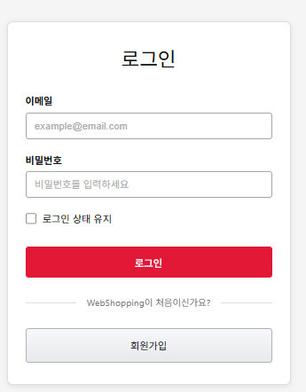
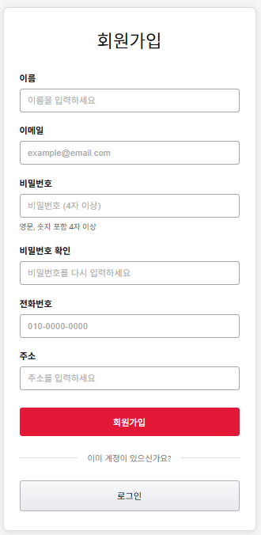
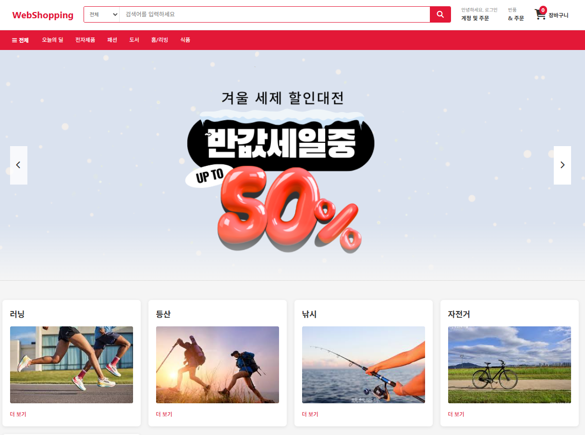
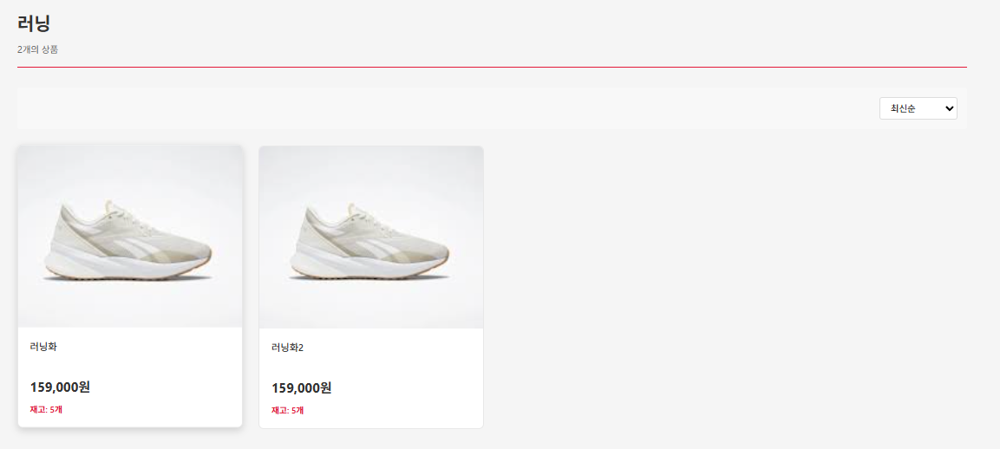
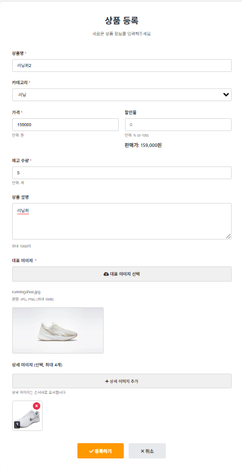

# 🛒 webShopping (쇼핑몰)

> **아웃도어 전문 쇼핑몰 플랫폼 🚧 진행 중**  
> 상품 관리부터 주문/결제 시스템까지 단계적으로 구현하는 E-commerce 프로젝트!

<br>

## 📖 목차
1. [프로젝트 소개](#-프로젝트-소개)
2. [주요 기능](#-주요-기능)
3. [화면 구성](#-화면-구성)
4. [기술 스택](#️-기술-스택)
5. [프로젝트 구조](#-프로젝트-구조)
6. [핵심 구현 사항](#-핵심-구현-사항)
7. [트러블슈팅](#-트러블슈팅)
8. [개발 과정 및 느낀 점](#-개발-과정-및-느낀-점)

<br>

---

## ✨ 프로젝트 소개

### 📌 개요
- **프로젝트명**: webShopping (아웃도어 쇼핑몰)
- **개발 기간**: 2024.11 ~ 진행 중 ⚙️
- **개발 인원**: 1명 (개인 프로젝트)
- **개발 상태**: 🚧 **지속 개발 중** - 상품 관리 완료, 주문/결제 시스템 구현 예정
- **프로젝트 목적**: 
  - 실무 수준의 쇼핑몰 플랫폼 구축 경험
  - Spring Boot & JPA 기반 상품 관리 시스템 개발
  - 다중 이미지 업로드 및 파일 관리 시스템 구현
  - 완전한 E-commerce 플랫폼으로 확장

### 🎯 기획 배경
실제 운영 가능한 E-commerce 플랫폼을 단계적으로 구축하며 Spring Boot 실무 역량을 강화하고자 시작한 프로젝트입니다.

**✅ 현재 완료된 기능:**
- 상품 등록/조회/수정/삭제 (CRUD)
- 다중 이미지 업로드 시스템 (대표 이미지 + 상세 이미지 최대 5개)
- 카테고리별 상품 분류 및 필터링
- 할인율 자동 계산 및 실시간 가격 표시
- Spring Security 기반 회원 인증/인가

**🚀 진행 예정 기능:**
- 장바구니 시스템 (Session 기반 → Redis 전환 예정)
- 주문/결제 시스템 (PortOne API 연동)
- 상품 검색 기능 (키워드 검색, 가격/카테고리 필터링)
- 주문 내역 조회 및 배송 추적
- AWS S3 이미지 업로드 전환

<br>

---

## ✨ 주요 기능

### 👥 **1. 회원 관리**
- **회원가입 / 로그인**: Spring Security 기반 인증
- **역할 기반 접근 제어**: ADMIN, USER 권한 분리

### 📦 **2. 상품 관리 (관리자)**
- **상품 등록**: 
  - 대표 이미지 1개 + 상세 이미지 최대 5개 업로드
  - 카테고리, 가격, 재고, 할인율 설정
  - 상품 설명 HTML 에디터 지원
- **상품 수정**: 
  - 기존 이미지 유지/삭제 선택 가능
  - 이미지 순서 변경 지원
  - 실시간 할인가 미리보기
- **상품 삭제**: 
  - Cascade 삭제로 연관 이미지 자동 삭제
  - 안전한 파일 시스템 정리

### 🛍️ **3. 상품 조회 (사용자)**
- **카테고리별 상품 목록**: 
  - 하이킹, 캠핑, 낚시, 러닝, 사이클링 등
  - 대표 이미지 썸네일 표시
  - 할인가 자동 계산 및 표시
- **상품 상세 페이지**: 
  - 대표 이미지 크게 표시
  - 상세 이미지 갤러리 형식 나열
  - 재고 상태 실시간 표시

### 💰 **4. 할인 시스템**
- **할인율 적용**: 
  - 원가 대비 할인율 자동 계산
  - 할인가 실시간 표시
  - 할인율 0% 시 정상가 표시

### 🖼️ **5. 다중 이미지 관리**
- **대표 이미지 (RepImg)**: 
  - `repImgYn = 'Y'` 플래그로 구분
  - 목록 페이지 썸네일용
- **상세 이미지**: 
  - `imageOrder` 필드로 순서 관리
  - 최대 5개까지 업로드
  - 상품 상세 페이지 갤러리 표시

<br>

---

## 📸 화면 구성

### 🔐 **로그인 페이지**
> Spring Security 기반 인증



<br>

### 📝 **회원가입 페이지**
> 신규 회원 등록



<br>

### 🏠 **메인 페이지**
> 카테고리별 상품 진입



<br>

### 🛍️ **상품 목록 페이지**
> 카테고리별 상품 목록 및 할인가 표시



<br>

### ✍️ **상품 등록 페이지 (관리자)**
> 다중 이미지 업로드 및 상품 정보 입력



<br>

---

## 🛠️ 기술 스택

### **Backend**


### **Frontend**


### **Database**


### **Build Tool**


### **Version Control**


<br>

---

## 📂 프로젝트 구조

```
webShopping/
├── src/
│   ├── main/
│   │   ├── java/com/example/webshopping/
│   │   │   ├── config/              # Spring Security, 파일 업로드 설정
│   │   │   ├── constant/            # Role 등 상수 정의
│   │   │   ├── controller/          # MVC 컨트롤러
│   │   │   │   ├── MainController.java
│   │   │   │   ├── ProductController.java
│   │   │   │   └── MembersController.java
│   │   │   ├── dto/                 # 데이터 전송 객체
│   │   │   │   └── ProductDTO.java
│   │   │   ├── entity/              # JPA 엔티티
│   │   │   │   ├── Product.java         # 상품 엔티티
│   │   │   │   ├── ProductImage.java    # 상품 이미지 엔티티
│   │   │   │   ├── Category.java        # 카테고리 엔티티
│   │   │   │   └── Members.java         # 회원 엔티티
│   │   │   ├── repository/          # Spring Data JPA 리포지토리
│   │   │   ├── service/             # 비즈니스 로직
│   │   │   │   ├── ProductService.java
│   │   │   │   └── FileService.java
│   │   │   └── WebShoppingApplication.java
│   │   └── resources/
│   │       ├── templates/           # Thymeleaf 템플릿
│   │       │   ├── main.html
│   │       │   ├── layout/
│   │       │   ├── members/
│   │       │   └── product/
│   │       │       ├── form.html        # 상품 등록/수정 폼
│   │       │       ├── list.html        # 상품 목록
│   │       │       └── detail.html      # 상품 상세
│   │       ├── static/              # CSS, JS, 이미지
│   │       └── application.properties
│   └── test/                        # 테스트 코드
└── build.gradle
```

<br>

---

## 🔥 핵심 구현 사항

### 1️⃣ **다중 이미지 업로드 시스템**

#### 📌 **ProductImage 엔티티 설계**
```java
@Entity
public class ProductImage {
    @Id
    @GeneratedValue(strategy = GenerationType.IDENTITY)
    private Long id;
    
    @ManyToOne(fetch = FetchType.LAZY)
    @JoinColumn(name = "product_id")
    private Product product;
    
    private String imageUrl;        // 이미지 저장 경로
    private String repImgYn;        // 대표 이미지 여부 (Y/N)
    private Integer imageOrder;     // 이미지 순서
}
```

#### 📌 **Product 엔티티의 이미지 관리 메서드**
```java
@Entity
public class Product {
    @OneToMany(mappedBy = "product", cascade = CascadeType.ALL, orphanRemoval = true)
    @OrderBy("imageOrder ASC")
    private List<ProductImage> images = new ArrayList<>();
    
    // 대표 이미지 URL 조회
    public String getRepImageUrl() {
        return images.stream()
                .filter(img -> "Y".equals(img.getRepImgYn()))
                .findFirst()
                .map(ProductImage::getImageUrl)
                .orElse(null);
    }
    
    // 상세 이미지 URL 리스트 조회 (순서대로)
    public List<String> getDetailImageUrls() {
        return images.stream()
                .filter(img -> "N".equals(img.getRepImgYn()))
                .sorted(Comparator.comparing(ProductImage::getImageOrder))
                .map(ProductImage::getImageUrl)
                .collect(Collectors.toList());
    }
    
    // 이미지 추가 (양방향 연관관계 설정)
    public void addImage(ProductImage image) {
        images.add(image);
        image.setProduct(this);
    }
}
```

<br>

### 2️⃣ **파일 업로드 서비스**

#### 📌 **FileService 구현**
```java
@Service
public class FileService {
    @Value("${file.upload-dir}")
    private String uploadDir;
    
    public String uploadFile(MultipartFile file) {
        // 원본 파일명
        String originalFilename = file.getOriginalFilename();
        
        // UUID로 고유한 파일명 생성
        String savedFilename = UUID.randomUUID() + "_" + originalFilename;
        
        // 파일 저장 경로
        Path filePath = Paths.get(uploadDir, savedFilename);
        
        // 파일 저장
        Files.copy(file.getInputStream(), filePath, StandardCopyOption.REPLACE_EXISTING);
        
        return "/uploads/" + savedFilename;
    }
}
```

#### 📌 **컨트롤러에서 다중 파일 처리**
```java
@PostMapping("/register")
public String register(ProductDTO productDTO,
                       @RequestParam(required = false) MultipartFile mainImageFile,
                       @RequestParam(required = false) List<MultipartFile> detailImageFiles) {
    
    List<String> imageUrls = new ArrayList<>();
    
    // 대표 이미지 저장
    if (mainImageFile != null && !mainImageFile.isEmpty()) {
        String mainUrl = fileService.uploadFile(mainImageFile);
        imageUrls.add(mainUrl);
    }
    
    // 상세 이미지 저장
    if (detailImageFiles != null && !detailImageFiles.isEmpty()) {
        for (MultipartFile file : detailImageFiles) {
            if (!file.isEmpty()) {
                String url = fileService.uploadFile(file);
                imageUrls.add(url);
            }
        }
    }
    
    // 서비스 호출
    productService.create(productDTO, imageUrls);
    
    return "redirect:/product/register";
}
```

<br>

### 3️⃣ **할인가 자동 계산**

#### 📌 **Product 엔티티의 할인 로직**
```java
@Entity
public class Product {
    private Integer price;           // 원가
    private Integer discountRate;    // 할인율 (%)
    
    // 할인가 계산 메서드
    public Integer getDiscountPrice() {
        if (discountRate != null && discountRate > 0) {
            return price - (price * discountRate / 100);
        }
        return price;
    }
}
```

#### 📌 **Thymeleaf 템플릿에서 할인가 표시**
```html
<!-- 할인율이 있는 경우 -->
<div th:if="${product.discountRate != null and product.discountRate > 0}">
    <span class="original-price" th:text="${product.price} + '원'">10,000원</span>
    <span class="discount-rate" th:text="${product.discountRate} + '%'">10%</span>
    <span class="discount-price" th:text="${product.discountPrice} + '원'">9,000원</span>
</div>

<!-- 할인율이 없는 경우 -->
<div th:unless="${product.discountRate != null and product.discountRate > 0}">
    <span class="price" th:text="${product.price} + '원'">10,000원</span>
</div>
```

<br>

### 4️⃣ **Cascade 연관관계 관리**

#### 📌 **Product 삭제 시 이미지 자동 삭제**
```java
@Entity
public class Product {
    @OneToMany(mappedBy = "product", 
               cascade = CascadeType.ALL,  // 모든 영속성 전이
               orphanRemoval = true)        // 고아 객체 자동 삭제
    private List<ProductImage> images = new ArrayList<>();
}
```

#### 📌 **상품 수정 시 이미지 업데이트**
```java
@Service
public class ProductService {
    @Transactional
    public void update(Long id, ProductDTO dto, 
                      MultipartFile mainImage, 
                      List<MultipartFile> detailImages,
                      Boolean keepMainImage) {
        
        Product product = productRepository.findById(id)
            .orElseThrow(() -> new EntityNotFoundException("상품 없음"));
        
        // 기본 정보 업데이트
        product.setProductName(dto.getProductName());
        product.setPrice(dto.getPrice());
        
        // 대표 이미지 교체 (기존 삭제 안 함)
        if (!keepMainImage && mainImage != null && !mainImage.isEmpty()) {
            // 기존 대표 이미지 찾아서 업데이트
            product.getImages().stream()
                .filter(img -> "Y".equals(img.getRepImgYn()))
                .findFirst()
                .ifPresent(img -> {
                    String newUrl = fileService.uploadFile(mainImage);
                    img.setImageUrl(newUrl);
                });
        }
        
        // 상세 이미지 추가
        if (detailImages != null && !detailImages.isEmpty()) {
            int currentOrder = product.getImages().size();
            for (MultipartFile file : detailImages) {
                if (!file.isEmpty()) {
                    String url = fileService.uploadFile(file);
                    ProductImage newImage = ProductImage.builder()
                        .imageUrl(url)
                        .repImgYn("N")
                        .imageOrder(currentOrder++)
                        .build();
                    product.addImage(newImage);
                }
            }
        }
        
        productRepository.save(product);
    }
}
```

<br>

---

## 🚧 트러블슈팅

### 1️⃣ **문제: 이미지 업로드 시 파일 경로 설정 오류**

#### 🔴 **발생 원인**
```java
// 문제가 된 코드
@Value("${file.upload-dir}")
private String uploadDir = "uploads/"; // application.properties 설정 무시됨
```

#### ✅ **해결 방법**
```java
// 수정된 코드
@Value("${file.upload-dir}")
private String uploadDir; // 기본값 제거

// application.properties
file.upload-dir=C:/uploads/products
```

#### 📌 **배운 점**
- `@Value`로 주입받는 필드는 기본값을 설정하면 안 됨
- 파일 경로는 절대 경로로 설정하는 것이 안전

<br>

### 2️⃣ **문제: 상품 수정 시 이미지 중복 업로드**

#### 🔴 **발생 상황**
- 상품 수정 시 기존 이미지 유지 옵션을 선택해도 새 이미지가 추가로 업로드됨
- `orphanRemoval = true` 때문에 기존 이미지 삭제됨

#### ✅ **해결 방법**
```java
// 기존 이미지 유지 여부 파라미터 추가
@PostMapping("/edit/{id}")
public String edit(...,
                   @RequestParam(required = false, defaultValue = "false") Boolean keepMainImage) {
    
    // 대표 이미지 교체 로직
    if (!keepMainImage && mainImage != null && !mainImage.isEmpty()) {
        // 기존 이미지 URL만 변경 (엔티티는 유지)
        product.getImages().stream()
            .filter(img -> "Y".equals(img.getRepImgYn()))
            .findFirst()
            .ifPresent(img -> img.setImageUrl(newUrl));
    }
}
```

#### 📌 **배운 점**
- `orphanRemoval`과 `cascade`의 차이점 명확히 이해
- 이미지 교체 시 URL만 변경하는 것이 효율적

<br>

### 3️⃣ **문제: Thymeleaf에서 할인가 표시 시 null 처리**

#### 🔴 **발생 원인**
```html
<!-- 문제가 된 코드 -->
<span th:text="${product.discountPrice} + '원'">할인가</span>
<!-- discountRate가 null일 때 NPE 발생 -->
```

#### ✅ **해결 방법**
```java
// Product 엔티티
public Integer getDiscountPrice() {
    if (discountRate != null && discountRate > 0) {  // null 체크 추가
        return price - (price * discountRate / 100);
    }
    return price;
}
```

```html
<!-- Thymeleaf 템플릿 -->
<div th:if="${product.discountRate != null and product.discountRate > 0}">
    <span class="discount-price" th:text="${product.discountPrice} + '원'"></span>
</div>
```

#### 📌 **배운 점**
- 엔티티 메서드에서 null 안전성 확보 중요
- Thymeleaf의 조건부 렌더링 활용

<br>

---

## 💡 개발 과정 및 느낀 점

### 📚 **배운 점**
1. **다중 이미지 업로드 시스템 설계**: 
   - 대표 이미지와 상세 이미지를 구분하는 설계 경험
   - `repImgYn`, `imageOrder` 필드를 활용한 유연한 이미지 관리
   - 상품별 최대 6개 이미지 업로드 및 순서 관리

2. **파일 업로드 보안 & 최적화**: 
   - UUID를 활용한 파일명 중복 방지
   - 허용된 확장자만 업로드하도록 검증
   - 파일 크기 제한 설정 (10MB)

3. **JPA Cascade 실전 활용**: 
   - `CascadeType.ALL`과 `orphanRemoval`의 차이점 체감
   - 연관관계 편의 메서드의 중요성
   - 상품 삭제 시 연관 이미지 자동 정리

4. **비즈니스 로직 분리**: 
   - 할인가 계산을 엔티티 메서드로 분리
   - Controller → Service → Repository 계층 명확히 구분
   - DTO를 활용한 화면-엔티티 분리

### 🚀 **향후 개발 방향**

#### **1단계: 장바구니 & 주문 시스템 (진행 예정)**
```
✅ 구현 계획:
- Session 기반 장바구니 (비회원 지원)
- 주문 엔티티 설계 (Order, OrderItem)
- 주문 상태 관리 (주문완료, 배송중, 배송완료, 취소)
- 재고 관리 시스템 (주문 시 재고 차감)
```

#### **2단계: 결제 시스템 (진행 예정)**
```
✅ 구현 계획:
- PortOne(구 아임포트) API 연동
- 결제 수단: 카드, 계좌이체, 무통장입금
- 결제 실패/취소 처리 로직
- 결제 내역 조회 및 영수증 발행
```

#### **3단계: 검색 & 필터링 기능 (진행 예정)**
```
✅ 구현 계획:
- 상품명 키워드 검색 (QueryDSL 활용)
- 가격대별 필터링 (최소가 ~ 최대가)
- 카테고리 + 검색어 조합 검색
- 정렬 기능 (최신순, 가격순, 인기순)
```

#### **4단계: 인프라 개선 (진행 예정)**
```
✅ 구현 계획:
- AWS S3로 이미지 업로드 전환
- Redis Session 관리 (장바구니 성능 향상)
- AWS RDS 데이터베이스 전환
- Docker 컨테이너 기반 배포
```

### 🎯 **장기 목표**
- **관리자 대시보드**: 판매 통계, 재고 관리, 주문 현황
- **리뷰 시스템**: 구매 후 리뷰 작성, 별점 평가
- **쿠폰 & 프로모션**: 할인 쿠폰, 이벤트 배너 관리
- **추천 알고리즘**: 구매 이력 기반 상품 추천

<br>

---

## 🔗 관련 링크
- **GitHub Repository**: [https://github.com/yourusername/webShopping](https://github.com/yourusername/webShopping)
- **시연 영상**: (추가 예정)
- **배포 URL**: (추가 예정)

<br>

---

## 📧 Contact
- **이메일**: hyochan.lee91@gmail.com

---

